---

---
---
autor: zhuit8
tipo: writeup
plataforma: whoami-labs
maquina: FOSA
ip: 172.17.0.2
dificultad: xxx
estado: finalizada

---
# Informe de Seguridad:
# FOSA

## 1. Resumen Ejecutivo
**Puntuación de Riesgo:** Crítico

Se ha comprometido la máquina una vez reconocido el servicio FTP para conexiones anonymous y fuerza bruta sobre el usuario encontrado. Se consigue elevar privilegios explotando la vulnerabilidad CVE 2021-3156, la cual consiste en un fallo de desbordamiento de buffer (heap-based buffer overflow)

## 2. Resumen Técnico (Matriz de Hallazgos)
| ID  | Vulnerabilidad | Severidad | Estado    |
| --- | -------------- | --------- | --------- |
| 01  | FTP anonymoues | Crítica   | Explotada |
| 02  | Baron Samedit  | Crítica   | Explotado |
|     |                |           |           |

---
## 3. Fase de Reconocimiento
### Enumeración de Puertos (Nmap)

```bash
sudo nmap -p- --open -sS -sC -sV --min-rate 5000 -vvvv -n -Pn 172.17.0.2
```

- **Puertos abiertos:** 21, 22, 80, 139, 445.
- **Evidencias:** > [!info] Resultado Nmap >                                                                      
# Nmap 7.99 `nmap -p- --open -sS --min-rate 5000 -v`
 -oN allports.txt 172.17.0.2
Nmap scan report for 172.17.0.2
Host is up (0.0000050s latency).
Not shown: 65530 closed tcp ports (reset)
PORT    STATE SERVICE
21/tcp  open  ftp
22/tcp  open  ssh
80/tcp  open  http
139/tcp open  netbios-ssn
445/tcp open  microsoft-ds
MAC Address: EA:74:E8:EA:62:46 (Unknown)

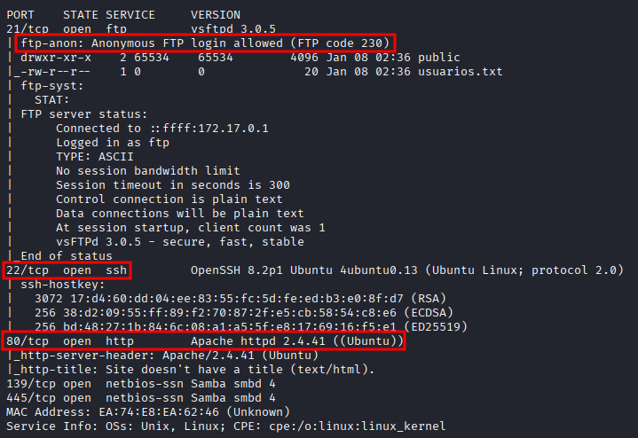

Se realiza conexión mediante FTP anonymous

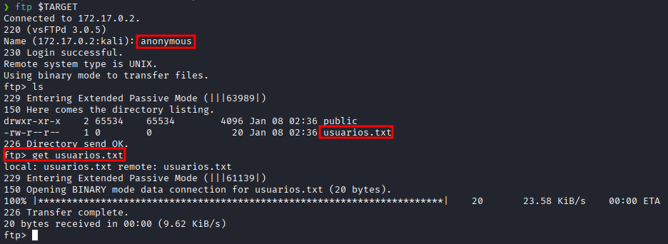

Se obtiene listado de usuarios

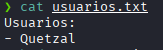

Se comprueba el puerto 80

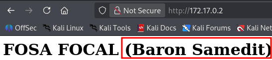


### Fuerza Bruta

Se hace fuerza burta con hydra al usario contenido en el fichero, haciendo uso del diccionario rockyou al protocolo SSH del puerto 22

```bash
 hydra -l Quetzal -P /usr/share/wordlists/rockyou.txt ssh://$TARGET -t 4 -f -V
```

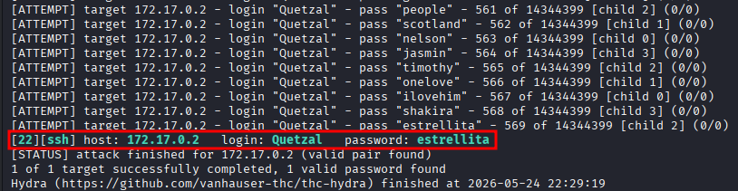

---
## 4. Análisis y Explotación
### Vector de entrada: mediante protocolo SSH una vez conseguida la fuerza bruta sobre el usuario.

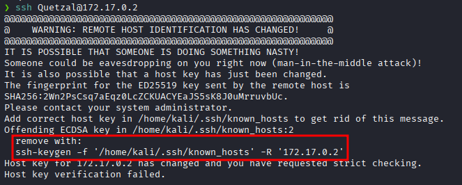

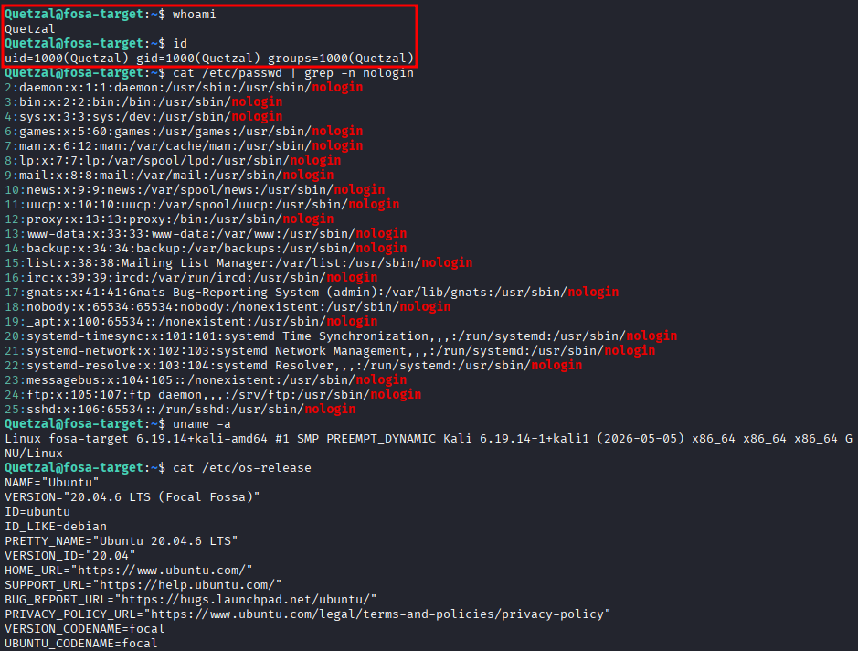

Se comprueba la versión SUDO del sistema

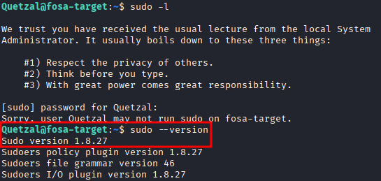

Se conoce que la versión SUDO es vulnerable, aún así se ejecuta Linpeas para encontrar más vectores de entrada

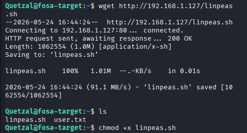

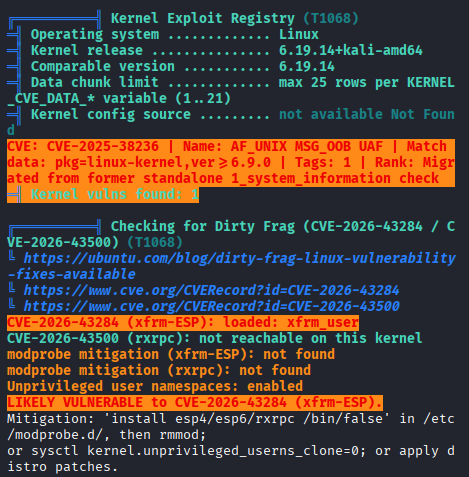

### Post-Explotación
- **usuario obtenido:** `www-data` 
- **Escalada de privilegios:** : [[../../../03_Payloads/Baron Samedit]]
Al acceder a la web, aparece el nombre de la máquina relacionado con esta vulnerabilidad. Además al comprobar la versión de sudo, vemos que es vulnerable con este CVE.
- **Paylod utilizado:** [[../../../03_Payloads/Baron Samedit]]
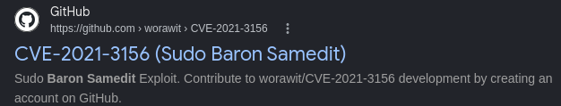
- Técnica utilizada [[Búsqueda de vulnerabilidades en la versión SUDO]]
- Se observa que la versión de SUDO es vulnerable al anterior CVE
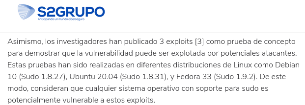

### Descarga del CVE en la máquina

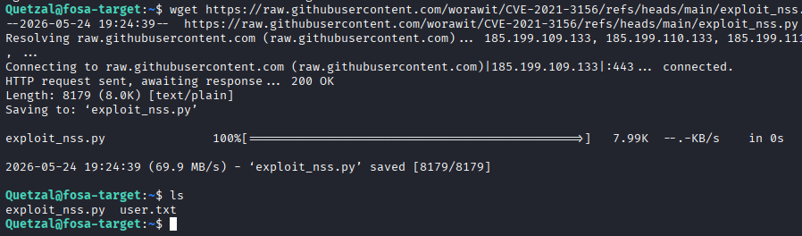

### Escalada a root

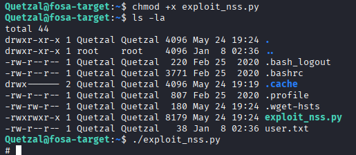


### Captura de Flag
`flag:{CTF{Baron_Samedit_Heap_Overflow_Success}`

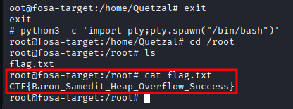

---
## 5. Recomendaciones y Conclusiones
### Remediación Técnica

La remediación principal para la vulnerabilidad **Baron Samedit** (CVE-2021-3156) es actualizar el paquete `sudo` a una versión segura.

Remediaciones Técnicas Principales

- **Actualizar Sudo**: Instalar la versión `1.9.5p2` o superior.
- **Parchear el Sistema**: Ejecutar el gestor de paquetes correspondiente según la distribución:
    - En Ubuntu/Debian: `sudo apt update && sudo apt install --only-upgrade sudo`
    - En RHEL/CentOS: `sudo yum update sudo`

### Conclusión Final
La explotación de la vulnerabilidad **Baron Samedit (CVE-2021-3156)** permitió una elevación de privilegios local a `root`. Esto demuestra que cualquier usuario con acceso limitado puede tomar el control total del servidor. Debido a la disponibilidad de exploits públicos, el riesgo para la confidencialidad e integridad del sistema es crítico. Es urgente aplicar las actualizaciones de seguridad de `sudo` de forma inmediata.

 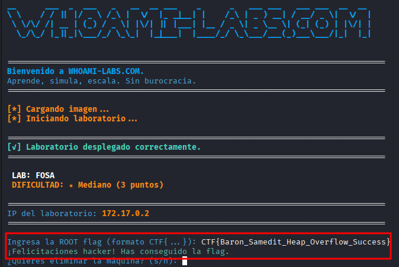
 